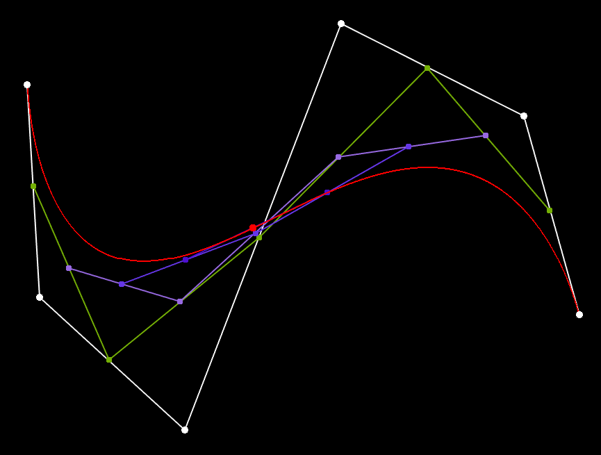

# Bezier curves in OpenGl

This program can render any grade Bezier curves with basic editing tools  
To see controls, check [Instruction](Instruction.md)

Program uses OpenGL, GLEW and GLFW

Made in VS by [Lucius 15](https://github.com/Lucius15) and [Kittenlover](https://github.com/Kittenlover229)
